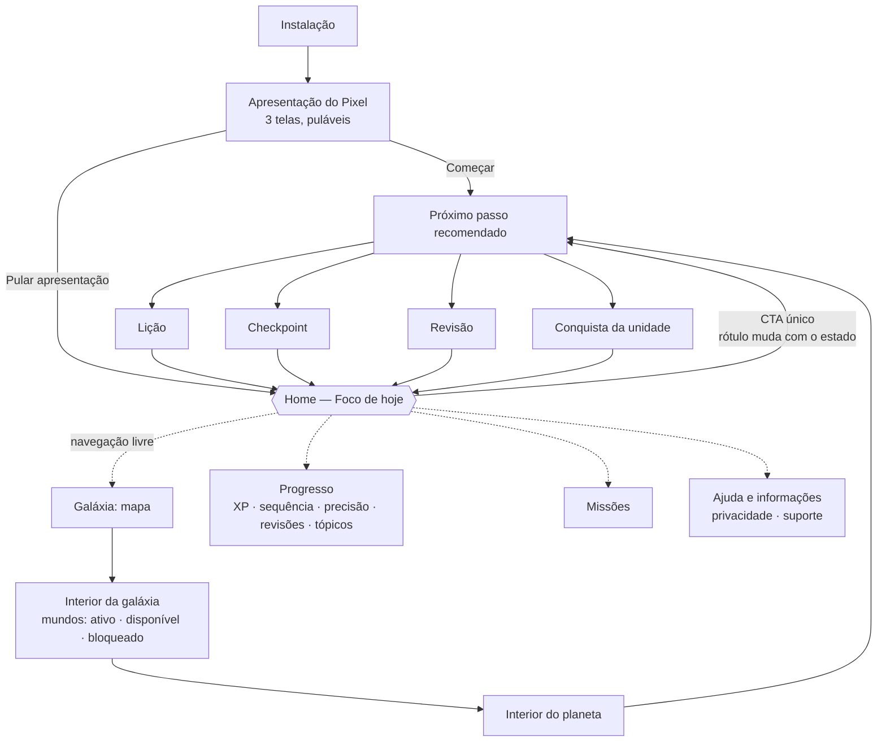
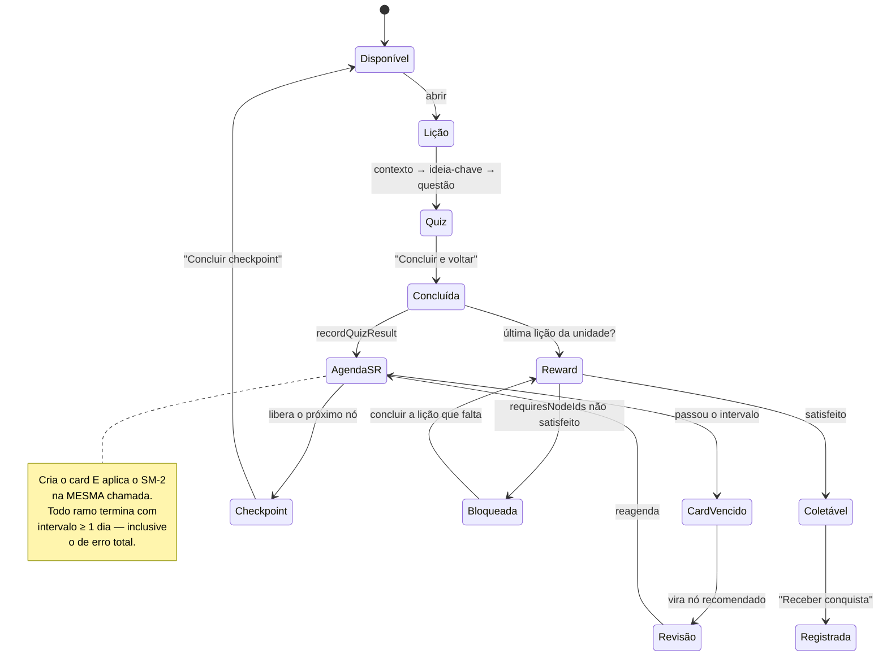

# Fluxo do cliente — o que o app faz com quem o usa

Escrito em 2026-08-06 a partir do **código**, não do roadmap. Cada afirmação
abaixo aponta para o arquivo que a sustenta, porque um diagrama sem procedência
envelhece sem avisar.

> **Este documento mora em `docs/` de propósito.** Ele descreve comportamento
> que muda com o código, então precisa mudar no mesmo commit — sob validador e
> sob revisão. O cérebro aponta para cá; a cópia não vive lá.

## Projeção no cérebro Obsidian

Em 2026-08-08, a pedido do dono, o caminho da pessoa ganhou uma projeção
renderizável no módulo opcional `10 Fluxo do usuário.md` do cérebro do Radiant.
Ela serve como mapa de navegação e raciocínio no Obsidian; **não substitui este
arquivo como fonte operacional**. O módulo declara essa precedência, aponta para
o PDF imprimível `docs/CLIENT_FLOW_PRINT.pdf` e só pode ser reprojetado pela CLI
pública do Loop — nunca por edição manual do vault.

São dois diagramas porque são duas perguntas diferentes. O primeiro responde
"por onde a pessoa anda"; o segundo, "o que decide se o próximo passo abre".
Misturar os dois é o que torna esse tipo de desenho ilegível.

## 1. O caminho da pessoa

Na primeira instalação, **Começar** persiste o encerramento da apresentação,
consulta o progresso e abre o próximo nó elegível — normalmente a primeira
lição. **Pular apresentação** persiste a mesma saída e abre a Home. Não existe
wizard de especialidade/meta nesse caminho, e rever a apresentação a partir do
app não dispara navegação automática no final.

O **CTA da home é um só**, e o rótulo é que carrega o estado:
`Aguardando nova etapa` quando não há próximo nó, `Retomar etapa` quando o nó
está retomável, `Fazer revisão` quando venceu revisão, e o rótulo da conquista
quando o próximo nó é o reward
([`JourneyHomeScreen.tsx`](../radiant-app/src/features/journey/screens/JourneyHomeScreen.tsx)).
Isso importa para quem testa: **o mesmo botão anuncia coisas diferentes**, e o
roteiro de acessibilidade depende de saber qual estado está na tela.

Tudo isso funciona **sem conta e sem rede**. O relaunch com modo avião
preserva XP, sequência e catálogo — medido em iPhone físico em 2026-08-05.

## 2. O que decide se o próximo passo abre

Este diagrama descreve o agendador **legado**, que já governa a experiência
visível. O agendador novo por competência é tratado separadamente abaixo porque
seu lado de leitura ainda está desligado.

Três regras que o desenho existe para tornar visíveis:

1. **A revisão não é uma tela que se abre; é um nó que nasce quando o card
   vence.** `getDueLessons` filtra `nextReviewAt <= agora`
   ([`SpacedRepetitionService.ts`](../radiant-app/src/features/spaced-repetition/services/SpacedRepetitionService.ts)),
   e `recordQuizResult` cria o card **e** aplica o SM-2 na mesma chamada, com
   todo ramo terminando em intervalo ≥ 1 dia. Consequência prática, que já foi
   confundida com defeito: **`REVISÕES 0` no mesmo dia da lição é o único
   resultado possível**, e não autoriza patch.
2. **A conquista tem duas portas.** O nó de reward abre com
   `requiresNodeIds: [node:<última lição>]`; antes disso a tela existe, mostra
   `Bloqueada até a unidade fechar` e **não oferece botão de coleta**. É por
   isso que a cobertura de E2E são dois flows sobre o mesmo nó —
   `reward-locked.yaml` prova a recusa, `reward-unlock.yaml` prova a regra.
3. **Errar não trava a jornada.** Um quiz com 0% de acerto ainda concede XP e
   ainda agenda revisão: o ramo de falha do SM-2 reseta o intervalo para 1 dia
   em vez de zerar o progresso.

## O que estes diagramas NÃO dizem

- **Não descrevem a paywall.** O `PaywallOfferCard` existe no `CheckpointScreen`,
  mas `ENABLE_PAYWALL` não é declarada em nenhum perfil do `eas.json` e o
  default é `false` — na build que embarca, esse caminho não acontece.
- **Não descrevem sincronização remota.** `ENABLE_REMOTE_SYNC` é `false` nos
  perfis `preview` e `production`, e o sync já exigia `isApiConfigured()`.
- **Não descrevem a recomendação por competência como ativa.** A Task 11 já
  grava cartões por competência, mas `CompetencyReviewService.getDue` não tem
  chamador de produção e `computeSnapshot` não recebe vencimentos. Antes de
  ligar esse caminho, falta uma guarda explícita; até lá, quem decide revisões
  visíveis continua sendo o `SpacedRepetitionService` legado.
- **Não são especificação.** Descrevem o comportamento observado no código em
  2026-08-09. Onde divergirem do código, **o código está certo e este arquivo
  está velho** — corrija-o no mesmo commit que mudar o fluxo.
