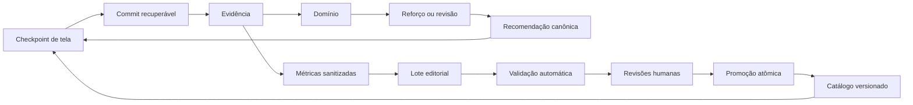

# Kernel de checkpoints e loops do aluno — Design

**Data:** 2026-08-09  
**Status:** aprovado; somente governança documentada  
**Decisor:** Anderson (proprietário do produto)  
**Plano:**
[`2026-08-09-checkpoints-e-loops-do-aluno.md`](../plans/2026-08-09-checkpoints-e-loops-do-aluno.md)  
**ADR:**
[`ADR-2026-08-09`](../../adr/ADR-2026-08-09-kernel-de-checkpoints-e-loops-do-aluno.md)

## 1. Resultado pretendido

Construir uma fundação única de checkpoints para as telas principais da jornada
do aluno. Essa fundação deve permitir retomada segura, recuperação depois de
crash e evolução do conteúdo sem duplicar as regras que já pertencem à jornada,
à evidência, ao domínio ou à revisão.

O sistema liga dois ciclos versionados:

1. **pedagógico:** checkpoint → evidência → domínio → reforço/revisão →
   recomendação;
2. **editorial:** lote → geração assistida → validação → revisões humanas →
   promoção → verificação.

A primeira arquitetura continua local-first, anônima, sem microserviços, sem
geração de conteúdo em runtime e sem dependência da API. O alvo de capacidade é
10 mil alunos ativos quando a sincronização for autorizada; esse alvo não exige
antecipar infraestrutura remota enquanto o app opera localmente.

## 2. Limites aprovados

### Dentro do desenho

- checkpoints nas **telas principais**, não em cada toque;
- estado mínimo retomável, nunca snapshot visual;
- kernel central, adaptadores por superfície e commit recuperável;
- modos `off`, `shadow` e `active` com falha fechada;
- checkpoint pedagógico de unidade e reforço adaptativo;
- painel editorial local, Git-first e com promoção atômica;
- contrato futuro de outbox e sincronização autenticada;
- gates de privacidade, acessibilidade, qualidade, desempenho e rollback.

### Fora deste marco de governança

- alterar código, stores, rotas, banco, API ou painel editorial;
- ativar checkpoint no runtime, telemetria ou sincronização remota;
- produzir ou promover a Unidade 1;
- publicar OTA, novo build ou binário;
- modificar a versão `1.3.1 (7)`, que está sob processo de revisão da Apple.

## 3. Estado que a implementação deve preservar

- `JourneyDefinitionService`, `JourneyProgressService` e
  `JourneyRecommendationService` continuam sendo a autoridade da jornada;
- `LearningEvidenceRepository`, `CompetencyMasteryService` e
  `CompetencyReviewService` continuam sendo autoridades dos seus domínios;
- o caminho legado permanece funcional durante toda a migração;
- progresso, XP, sequência e revisões continuam disponíveis sem conta e rede;
- falha de sync não bloqueia estudo;
- Galáxia e Progresso são projeções, não fontes concorrentes de progresso;
- a Task 11 permanece inerte para leitura até existir competência curricular v2;
- a Task 12 educacional continua pendente até que a fundação transacional a anteceda.

## 4. Vocabulário e superfícies

### Modos

`StudentCheckpointMode = 'off' | 'shadow' | 'active'`.

- `off`: não lê, não grava e não interfere no fluxo;
- `shadow`: observa e persiste em store isolado, mas não altera navegação,
  domínio, XP, desbloqueio ou sync;
- `active`: pode oferecer retomada e executar commits recuperáveis nas
  superfícies explicitamente habilitadas.

Valor ausente, inválido ou desconhecido resolve obrigatoriamente para `off`.
`preview` começa em `shadow`; `production` permanece em `off`; `active` é
restrito a desenvolvimento/build interna até que os gates do runbook fechem.

### Superfícies principais

`CheckpointSurface` é uma união fechada:

```text
first-run | home | galaxy-map | galaxy-interior | planet-interior |
missions | progress | lesson | legacy-quiz | unit-checkpoint |
review | reward
```

Essas superfícies correspondem às telas principais do fluxo atual. Uma
microinteração pode gerar evidência pedagógica ou telemetria sanitizada, mas não
cria por si só um checkpoint de tela.

### Fases

`CheckpointPhase` é uma união fechada:

```text
entered | in_progress | committed | completed | abandoned |
superseded | invalidated
```

Transições permitidas:

| Origem | Destinos permitidos |
| --- | --- |
| inexistente | `entered` |
| `entered` | `in_progress`, `abandoned`, `invalidated` |
| `in_progress` | `in_progress`, `committed`, `abandoned`, `superseded`, `invalidated` |
| `committed` | `completed`, `invalidated` |
| terminal | nenhum; uma nova entrada cria nova sequência |

`completed`, `abandoned`, `superseded` e `invalidated` são terminais. Repetir
uma operação com o mesmo identificador devolve o resultado já persistido.

## 5. Contrato do kernel

### `StudentCheckpointV1`

O contrato versionado contém apenas:

- `schemaVersion: 1`;
- `checkpointId`, `flowId` e `operationId?` opacos;
- `surface` e `phase` das uniões fechadas;
- ids estáveis de catálogo necessários para reconciliar a tela;
- `contentVersion` e `cursorId` estável;
- progresso agregado limitado ao necessário para retomada;
- `nextAction` de enum fechado;
- `sequence`, `createdAt`, `updatedAt` e `expiresAt?` somente para estado
  retomável efêmero sem efeito obrigatório iniciado;
- contador de falhas de restauração entre 0 e 2.

O contrato não aceita resposta, texto livre, estado visual, caminho de mídia,
URI, PII, PHI ou identificador persistente de aparelho. A allowlist normativa
está no
[`STUDENT_CHECKPOINT_PRIVACY_CONTRACT.md`](../../STUDENT_CHECKPOINT_PRIVACY_CONTRACT.md).

### `ScreenCheckpointAdapter`

Cada superfície fornece um adaptador puro que:

1. valida se o checkpoint pertence à superfície e ao fluxo atuais;
2. cria o estado mínimo a partir do domínio já existente;
3. reconcilia ids e versão com a autoridade do domínio;
4. decide se o cursor ainda é compatível;
5. devolve retomada, descarte ou fallback — nunca navega por conta própria.

Adaptadores não calculam domínio, XP, desbloqueio ou revisão. Eles chamam os
serviços donos dessas regras e convertem seus resultados para o contrato.

### `CheckpointCoordinator`

Interface pública mínima:

```text
enter(input) -> checkpoint | null
progress(input) -> checkpoint | null
commit(input) -> commit result
leave(input) -> checkpoint | null
restoreCandidate(context) -> resume | fallback | none
invalidate(input) -> invalidated | none
```

Todos os métodos recebem relógio e gerador de ids injetáveis. No modo `off`, são
no-op. No modo `shadow`, gravam apenas no store shadow e devolvem decisões que
não podem ser consumidas pela navegação. No modo `active`, só operam em
superfícies incluídas na allowlist de rollout.

## 6. Persistência e restauração

- ativo e shadow usam chaves físicas separadas;
- o envelope mantém um checkpoint atual por superfície;
- há no máximo um fluxo retomável global;
- o diário conserva 30 dias ou 500 transições, o que chegar primeiro;
- journals pendentes com operação e intenção imutável não entram na compactação;
- cancelar/inutilizar uma operação só é permitido antes do primeiro efeito
  obrigatório; depois dele, a operação deve reconciliar e terminar exatamente
  uma vez, mesmo que o checkpoint visual seja invalidado;
- escrita usa serialização validada e troca atômica quando o storage permitir;
- schema futuro, corrupção ou campo fora da allowlist são postos em quarentena,
  nunca reinterpretados permissivamente.

Uma restauração só é elegível quando superfície, versão, ids e cursor são
compatíveis com o catálogo e a jornada atuais. A primeira falha mantém o
checkpoint e oferece fallback seguro. A segunda falha consecutiva o invalida e
retorna à recomendação canônica da Home. Se houver commit iniciado, o fallback
visual não o cancela: o reconciliador continua até o terminal obrigatório.
Nenhuma invalidação apaga evidências, domínio, XP, sequência ou conclusões já
confirmadas.

As primeiras superfícies ativas serão apresentação, Lição, Revisão e checkpoint
de unidade. Home, Galáxia, interiores, Missões, Progresso, quiz legado e
recompensa registram checkpoints, mas inicialmente retomam pela Home.

## 7. Commit recuperável

Antes do primeiro efeito, o kernel cria `CommitOperationV1` e
`CommitIntentV1` e persiste ambos no mesmo `CommitJournalEntryV1`, em **uma
única escrita serializada e atômica**. Se essa escrita falhar, nenhum efeito
começa. A operação contém a máquina mutável; a intenção é um comando imutável
com ids de catálogo, resultados estruturados de item, deltas e eventos
planejados necessários para repetir tentativa, evidência, domínio/revisão,
XP/meta, jornada e enqueue depois de crash.

`CommitIntentV1` é união fechada em `lesson-completion`, `review-completion` e
`unit-checkpoint-attempt`, alinhada aos inputs atuais de `LessonOutcomeService`
e `useReview`. Não contém respostas, valores escolhidos, texto, PII ou PHI.
Cada `ItemOutcomeV1` guarda ids, `evidenceKind`, outcome, `hintUsed`, faixa de
duração e erro crítico. Referências externas só podem ser de catálogo
imutável; qualquer payload necessário ao replay vive dentro do mesmo journal,
nunca em outro store ainda não confirmado.

Ordem obrigatória:

1. tentativa;
2. evidência;
3. domínio;
4. revisão;
5. XP;
6. meta;
7. jornada;
Depois delas, entrega auxiliar por outbox.

`requiredMandatorySteps` persiste o subconjunto aplicável na ordem acima;
etapa não aplicável fica ausente. O terminal da saga
obrigatória é `mandatoryState=completed`; cancelamento só existe como
`cancelled-before-effects` com nenhuma etapa aplicada. Depois do primeiro efeito
não existe terminal de abandono/expiração: `in-progress` precisa reconciliar até
`completed`.

Cada autoridade recebe `operationId` e persiste `IdempotencyReceiptV1`, com
`effectKind` exato, no **mesmo registro durável ou transação atômica do único
efeito**. A janela efeito confirmado
sem recibo é proibida. A saga só marca a etapa concluída depois de ler o recibo.
Se houver crash depois de efeito+recibo e antes do marcador do journal, o
relaunch repete a chamada, o serviço devolve o recibo existente e nenhum efeito
é duplicado.

Outbox é auxiliar e usa estado independente:
`not-required | pending-delivery | delivered`. Telemetria/ciclo de vida local
não pertence à outbox: `LocalCheckpointEventV1` alimenta somente o artefato do
beta local, enquanto `OutboxEventV1.event` aceita exclusivamente
`SyncEventV1` pedagógico confirmado.

Falha de escrita local obrigatória não mostra conclusão nem desbloqueio. O nó
continua retomável e oferece retry ou retorno seguro à Home, enquanto a operação
permanece durável para reconciliação. Falha ao enfileirar não perde o evento:
persiste `pending-delivery` e mantém no intent cada `PlannedSyncEventV1` com
`eventId` determinístico. Crash depois do enqueue e antes de marcar entrega
repete o mesmo `eventId`; a outbox deduplica e devolve o resultado anterior. O
id existe apenas no envelope planejado/outbox, não no `SyncEventV1` aninhado.
Entrega auxiliar pendente nunca rebaixa o terminal obrigatório nem bloqueia
estudo.

Falhas automáticas usam `automaticRetryCount` de 0 a 20 e `retryEpoch`. Na 20ª,
a operação pausa em `paused-retry-limit` com próximo passo intacto e oferece
retry explícito ou Home. Retry explícito incrementa a época, zera o contador e
retoma exatamente o mesmo estado; operação com efeito iniciado nunca cancela.

`JourneyProgressService.pendingSyncEvents` e a fila especializada continuam
válidos durante a migração. A outbox genérica entra por compatibilidade, com
leitura dupla controlada e remoção dos contratos antigos somente após migração
e testes de equivalência.

## 8. Checkpoint pedagógico e reforço

`CheckpointAttemptV1` é imutável. Cada item vale o mesmo peso; um item com mais
de uma competência conta uma única vez na nota. Item pulado vale como incorreto.
Dica não produz recuperação independente. A tentativa passa somente quando:

```text
score >= 0,80 E criticalErrorCount == 0
```

O limite é inclusivo. XP, histórico ou domínio anterior não compensam erro
crítico na tentativa atual. Passar na unidade não promove automaticamente todas
as competências para `mastered`; domínio continua derivado das evidências
válidas e dos tetos curriculares.

Reprovação produz `ReinforcementPlanV1` somente para competências frágeis:

1. ciclo 1: explicação causal + prática guiada;
2. ciclo 2: modalidade diferente + aplicação independente + variante
   equivalente do checkpoint.

A sequência é obrigatória: tentativa inicial reprovada → ciclo 1 concluído →
nova tentativa; se ainda reprovar → ciclo 2 concluído → outra nova tentativa.
Somente se essa terceira tentativa ainda não for aprovada, depois dos dois
ciclos completos, o estado vira `support-required`. As dependências seguintes
permanecem bloqueadas, e a pessoa pode abrir revisão, Home e conteúdo anterior.
Nenhum progresso é apagado e a linguagem da interface não é punitiva.

## 9. Dois loops conectados



O loop pedagógico consome catálogo aprovado; não gera conteúdo. O loop
editorial usa métricas agregadas como sinal de revisão, mas nunca promove por
resultado automático isolado.

## 10. Contrato editorial

`ProductionBatchV1` referencia unidade, competências, fontes, mídia,
atividades, checkpoint, reforços, schemas e hashes. Todo conteúdo clínico e
pedagógico é versionado e imutável depois de promovido.

Gates independentes:

- validação automática;
- revisão clínica;
- revisão de direitos;
- revisão de acessibilidade;
- autorização explícita de promoção.

Cada decisão registra referência opaca do revisor, função, timestamp e hash do
material revisado. Alteração material invalida as aprovações afetadas.
Proveniência é por afirmação: enunciado, resposta, distratores e feedback ligam
às fontes permitidas e às decisões editoriais correspondentes.

O painel em `tools/editorial-panel/` permanece local e deve escutar somente em
`127.0.0.1`. Escritas exigem hash esperado, lock local, arquivo temporário e
rename. A promoção chama biblioteca allowlisted — nunca shell arbitrário — e
gera catálogo imutável, manifesto de hashes, changelog e referência de rollback.
Promoção parcial é proibida.

## 11. Sincronização futura

Sem remover endpoints existentes, uma onda posterior poderá adicionar:

- `POST /v1/sync/events/batch`, autenticado, com 1–100 eventos;
- `GET /v1/sync/state?cursor`, autenticado, para projeção incremental.

Somente `SyncEventV1` entra na outbox remota. A união fechada contém ao menos
tentativa confirmada, evidência imutável por competência/item com ids e
enums/booleanos — nunca resposta —, conclusão de review/jornada, ciclo de
reforço concluído e `support-required` confirmado com ids imutáveis de
plano/estado e relação entre tentativa fonte e follow-up. O `eventId` idempotente
vive uma única vez no envelope `OutboxEventV1`. Conclusões e evidências usam
união monotônica; domínio é recalculado pelo contrato vigente. Cursores incompletos são específicos
do dispositivo e não entram no merge de conteúdo confirmado. Eventos anônimos
ficam locais até a pessoa vincular uma conta; o payload não carrega email,
identificador de dispositivo ou token.

`LocalCheckpointEventV1` é uma união distinta para lifecycle/telemetria do
artefato local `beta-checkpoint-local-v1.jsonl`; não entra na outbox, não é
aceita pelo endpoint remoto e não se converte implicitamente em fato de sync.

Sync remoto permanece desligado até API, autenticação, autorização, conflitos,
privacidade e observabilidade terem evidência própria. A API pública atualmente
registrada em HTTP 502 não pertence ao caminho crítico deste trabalho.

### Modelo de workload remoto a validar

O alvo de 10 mil alunos ativos é uma hipótese de dimensionamento, não capacidade
medida. O gate de carga parte destas premissas explícitas:

- 10.000 contas ativas/dia;
- 40 eventos confirmados por aluno/dia = 400.000 eventos/dia;
- pico de 1.000 contas concorrentes e 100 requests/s por 15 minutos;
- batch médio de 20 e máximo de 100 eventos;
- chave única/indexada por `(account_id, event_id)` e índice de cursor por
  `(account_id, server_sequence)`;
- máximo de 20 tentativas por evento, backoff exponencial com jitter entre 1 s e
  6 h, batch local máximo 100 e no máximo 2 requests em voo por cliente;
- `429`/`5xx` aplicam backpressure sem descartar evento; fila acima do limite
  operacional pausa envio, preserva outbox e mantém estudo offline.

Antes de sync remoto, um teste reproduzível deve carregar 400 mil eventos
idempotentes, sustentar o pico por 15 minutos e executar soak de 24 h com retry,
duplicata e reconexão. Critérios: p95 de ingestão ≤300 ms, p95 da projeção
incremental ≤500 ms, erro não controlado <0,1%, zero perda, zero duplicação de
efeito e backlog drenado em até 30 minutos depois do pico. As premissas serão
substituídas por medição real antes de qualquer afirmação de capacidade.

## 12. Qualidade, desempenho e escala

- persistência p95 ≤75 ms, com mínimo de 20 execuções no mesmo aparelho/perfil;
- restauração p95 ≤100 ms, com mínimo de 20 execuções no mesmo aparelho/perfil;
- para p95 de cold start e Home→Lição, no mesmo aparelho/perfil e com no mínimo
  20 execuções antes/depois, delta permitido
  `novo_p95 - baseline_p95 <= max(0,05 × baseline_p95, 50 ms)`;
- diário limitado impede crescimento sem teto;
- processamento é O(1) para o checkpoint atual e limitado a 500 entradas para
  compactação/auditoria local;
- zero divergência determinística entre shadow e autoridade da jornada;
- pelo menos 100 retomadas elegíveis com sucesso ≥ 99% antes de produção;
- zero P0/P1 e zero incidente de privacidade.

O beta pedagógico inicial roda offline, com sync `off`, e usa como fonte
reproduzível o export allowlisted `beta-checkpoint-local-v1.jsonl` da UI interna
ou harness do sandbox iOS/Android. Validador e agregador geram manifest, audit de
privacidade e aggregate no diretório gitignored de artefatos Maestro. Eventos
são deduplicados por `localEventId`; denominador é `checkpointId` único com
`restore_offered/direct`, numerador é o correspondente `restore_succeeded`, e
fallbacks são contados por reason code. Gate: ≥100 elegíveis e ≥99%. Isso prova
o loop local, não observabilidade remota; o JSONL bruto nunca vai a git/chat.
Afirmação remota exige evento sintético consultado por id num sink verificado.

VoiceOver, TalkBack, viewport curto e aparelhos reais continuam gates manuais
separados. `200` de API, quando existir, não substitui prova de integridade do
estado local.

## 13. Rollout e rollback

Ordem obrigatória:

1. governança;
2. fundação transacional em `off`;
3. adaptadores em `shadow`;
4. runtime `active` somente interno;
5. Task 12 educacional e reforço;
6. Galáxia, pipeline v2 e Unidade 1;
7. outbox local e beta pedagógico offline; expansão depois dos gates da Unidade
   1 e do beta local; em trilha separada, carga/sink/API antes do sync remoto.

Cada onda fecha seus próprios testes antes da seguinte. O modo pode ser
desligado sem apagar progresso nem o store novo. Perda, desbloqueio incorreto,
crash loop, payload proibido ou divergência shadow determinística acionam
rollback imediato conforme o
[`runbook`](../../runbooks/student-checkpoint-rollout-rollback.md).

Esta aprovação não autoriza OTA, build ou publicação sobre `1.3.1 (7)`.

## 14. Decision log

| Decisão | Alternativas | Motivo |
| --- | --- | --- |
| checkpoint por tela principal | cada toque ou só analytics | retomada útil sem explosão de estado |
| estado mínimo retomável | snapshot visual | desacopla persistência da UI |
| kernel central + adaptadores | lógica por tela | uma máquina de estados, domínios preservados |
| `off/shadow/active` | flag booleana | rollout observável e falha fechada |
| stores ativo/shadow separados | chave compartilhada | shadow não contamina produção |
| commit persistido antes dos efeitos | melhor esforço | crash recovery exatamente uma vez |
| operação + intent na mesma escrita | operação sem payload de replay | relaunch independe de UI/store não confirmado |
| recibo atômico por `operationId` em todos os serviços | dedupe apenas na fila | evita efeito sem recibo e duplicação em qualquer etapa |
| eventos locais separados de `SyncEventV1` | uma união para tudo | beta local não amplia coleta remota |
| dois ciclos de reforço | repetição integral | corrige fragilidades sem punição |
| revisão humana independente | aprovação única | clínica, direitos e acessibilidade são riscos distintos |
| local-first e sync posterior | API como requisito | preserva o produto lançável e offline |
| produção continua `off` | ativar na `1.3.1 (7)` | não alterar binário em revisão |
