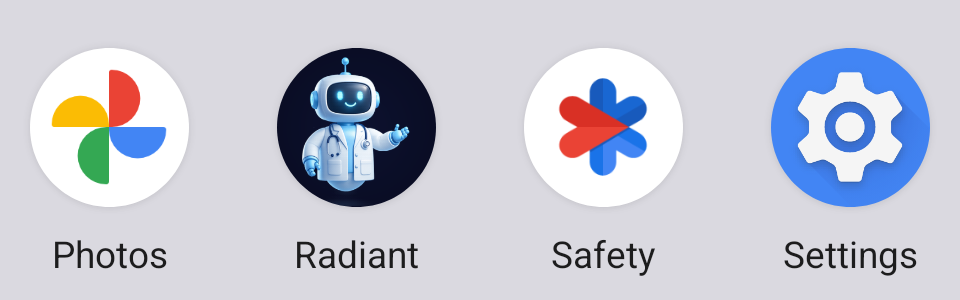
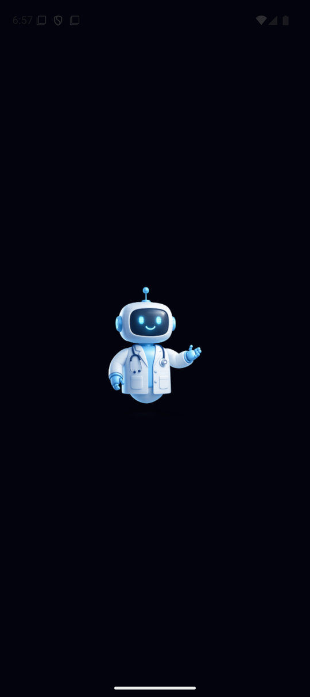
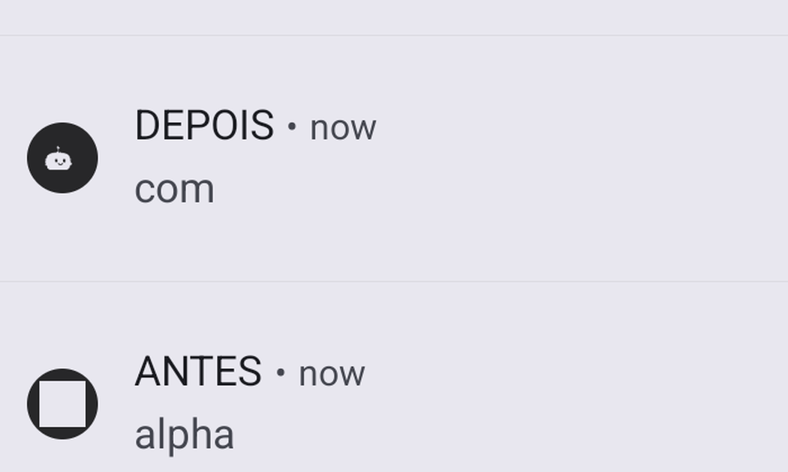

# Ícone da marca Pixel — evidência em device — 2026-07-29

**Task:** Task 6 do [plano do ícone](../../../docs/superpowers/plans/2026-07-29-icone-do-app.md);
fecha E6 do roadmap e a parte gráfica de E1/L2.7.

**Resultado:** **3 de 4 provas de runtime obtidas.** Launcher, splash e ícone de
notificação verificados em device. A prova do *themed icon* do Android 13+ **não
foi obtida** — motivo e o que falta na seção final. O que foi verificado, foi
verificado no aparelho, não deduzido.

**Build sob teste:** APK `release` local, `com.ascendcreative.radiant` 1.3.0
(versionCode 2). As provas foram capturadas em duas rodadas — ver a nota abaixo.

> **Recaptura de 2026-07-29, após a decisão de enquadramento.** O enquadramento do
> Pixel foi alinhado à spec (62% da largura) depois da primeira rodada de provas,
> o que regerou `icon.png`, `splash-icon.png`, `favicon.png` e `play-icon-512.png`.
> A **prova 2 (splash) foi recapturada** sobre o APK reconstruído às 18:56.
>
> A **prova 1 (launcher) não precisou de recaptura**, e isso é um fato medido, não
> uma conveniência: a camada `foreground` do adaptive icon é dimensionada pela
> **zona segura** (62,5% da altura, medido nos recursos nativos antes e depois),
> não pelo parâmetro de enquadramento. O launcher é indiferente a essa decisão.
> A **prova 4 (notificação)** também não depende dela — a silhueta é gerada com
> seu próprio `fill`.

## Por que este documento existe

O contrato `icon-assets-contract.test.mjs` pega violação de **especificação** —
dimensão, alpha, peso, proporção. Ele **não** teria pego a grade de construção
embutida na arte, que passa em qualquer verificação geométrica. Arte errada só é
pega por evidência em device somada a revisão humana. É isto.

## Receita de build

Registrada aqui porque **não estava no plano** e custou dois builds descobrir.

```sh
cd radiant-app/android
export ANDROID_HOME=~/Library/Android/sdk ANDROID_SDK_ROOT=$ANDROID_HOME
export EXPO_NO_DOTENV=1 EXPO_PUBLIC_APP_ENV=production \
  EXPO_PUBLIC_ENABLE_DEV_TOOLS=false EXPO_PUBLIC_ENABLE_TELEMETRY_DEBUG_SCREEN=false \
  EXPO_PUBLIC_ENABLE_BETA_GATE=false EXPO_PUBLIC_ENABLE_LEARNING_ROAD=true \
  EXPO_PUBLIC_ENABLE_REMOTE_SYNC=false
export SENTRY_DISABLE_AUTO_UPLOAD=true
./gradlew assembleRelease --console=plain
adb install -r app/build/outputs/apk/release/app-release.apk
```

Duas diferenças deliberadas em relação à receita de
[`2026-07-28-android-e2e-first-run.md`](2026-07-28-android-e2e-first-run.md):

- **`APP_ENV=production`, não `development`.** Evidência de ícone e vitrine tem de
  mostrar o que o usuário recebe; um perfil de teste invalida a evidência.
- **`SENTRY_DISABLE_AUTO_UPLOAD=true` é obrigatório**, senão o build falha no
  upload de source maps por falta de credencial.

**Armadilha que custou um diagnóstico errado:** o Gradle **não invalida cache por
variável de ambiente**. Um build que reaproveita um bundle JS gerado sem as
`EXPO_PUBLIC_*` produz um app sem feature flags, e a home aparece com *"Nenhum
conteúdo elegível agora"* — o que parece defeito de produto e não é. Se acontecer,
apague `android/app/build/generated/assets/createBundleReleaseJsAndAssets` e
rebuilde. Foi diagnosticado erroneamente como defeito de produto antes de a causa
real aparecer.

## Verificação prévia no binário

Antes de olhar a tela, os recursos nativos foram inspecionados — timestamp de build
não é evidência de conteúdo:

| Recurso | Estado |
| --- | --- |
| `mipmap/ic_launcher_foreground` | Pixel, sem grade |
| `mipmap/ic_launcher_background` | gradiente galaxy, sem grade |
| `mipmap/ic_launcher_monochrome` | silhueta do rosto com olhos e sorriso vazados |
| `drawable/notification_icon` | silhueta 96×96, presente no APK (`aapt2 dump resources`) |
| `drawable/splashscreen_logo` | Pixel |
| `color/iconBackground` | `#07091c` |

## Prova 1 — ícone no launcher ✅



O Pixel aparece sob a máscara circular do launcher, sobre o fundo galaxy. **Sem a
grade de construção e sem o "A" em chevron da Ascend Creative.** Ambos os defeitos
que motivaram o plano estão ausentes na composição real.

Esta prova exige olhar a **composição**, não uma camada: o adaptive icon é a soma
de `foreground` + `background`, e foi exatamente inspecionar só a camada da frente
que produziu a conclusão errada de que "o launcher Android está limpo" quando a
camada de fundo tinha o mesmo defeito.

## Prova 2 — splash de abertura ✅



O Pixel flutua sobre o fundo `#03030d`. Confirma três correções de uma vez:

- o placeholder de alvo em blueprint **saiu**;
- o fundo **branco** saiu, em favor da identidade galaxy dark da ADR;
- o Pixel entra **sem tile de gradiente** — um tile desenharia um quadrado
  visivelmente mais claro sobre o fundo, o que foi verificado renderizando as duas
  opções antes de decidir.

**Por que a decisão do tile era load-bearing, e não estética.** Inspecionando os
recursos nativos gerados pelo `expo-splash-screen`, o plugin **assa o fundo dentro
do logo**: o `splashscreen_logo.png` nativo é opaco, com o canto em
`(3, 3, 13, 255)` — exatamente `#03030d`. Ou seja, o que estivesse por trás do
Pixel no PNG de origem viraria parte do bitmap. Com o tile de gradiente, o
quadrado mais claro teria sido assado e apareceria em todo cold start; com o
fundo transparente, o plugin assa a cor certa e a emenda some.

## Prova 3 — themed icon do Android 13+ ❌ NÃO OBTIDA

O toggle **Wallpaper & style → Themed icons** foi localizado na árvore
(`bounds [63,1595][871,1666]`, `checked=false`) e não alterna: taps no rótulo e no
switch deixam `checked=false`, e os ícones do sistema seguem coloridos na gaveta.
A imagem do emulador é **Google APIs**, sem o launcher completo do Pixel, e
aparentemente sem suporte real ao tema de ícones.

**O que já é certo:** o recurso `mipmap/ic_launcher_monochrome` existe no APK e
carrega a silhueta correta — verificado no arquivo. **O que falta:** a composição
em runtime sob o tema dinâmico.

**Como fechar:** repetir num aparelho Android 13+ real, ou numa imagem de emulador
com Play Store completa. Uma linha basta como evidência: a captura da gaveta com
*Themed icons* ligado.

## Prova 4 — ícone pequeno de notificação ✅ (hipótese confirmada)



Esta prova tinha um papel diferente das outras: **testar uma hipótese, não
confirmar um asset.** A spec e o plano afirmavam que o `icon.png` — sem alpha por
exigência da Apple — renderizaria como **retângulo sólido** ao ser usado como ícone
pequeno de notificação, porque o Android usa apenas o canal alpha como máscara de
silhueta. Isso tinha sido **deduzido da regra do Android, nunca observado**, e
estava registrado como hipótese.

**Método:** duas notificações postadas pela mesma via
(`cmd notification post -i file://…`), variando **apenas o bitmap**:

| Notificação | Bitmap | Resultado renderizado |
| --- | --- | --- |
| ANTES | `assets/images/icon.png` (sem alpha) | **quadrado sólido preenchido** |
| DEPOIS | `assets/images/notification-icon.png` (silhueta com alpha) | **rosto do Pixel, olhos e sorriso legíveis** |

**Veredito: a hipótese se confirmou.** O ícone antigo era ilegível como
notificação, e a correção da Task 4 resolve o defeito.

**Limite honesto do método:** as notificações foram postadas pelo shell, não pelo
app, então a cor de tint é a do sistema e não o `#0A84FF` que o
`expo-notifications` aplica. O que estava sob teste — o mascaramento por alpha — é
o mesmo pipeline nas duas vias. A tentativa de referenciar o drawable por pacote
(`@com.ascendcreative.radiant:drawable/notification_icon`) falha com
`invalid icon`; por isso o bitmap foi empurrado para o device e referenciado por
`file://`.

## Estado do ambiente ao fim

Resolução do emulador devolvida (`wm size reset`), arquivos temporários removidos
de `/data/local/tmp`. O toggle de themed icons permaneceu **desligado**, como
estava — nunca chegou a ligar.
